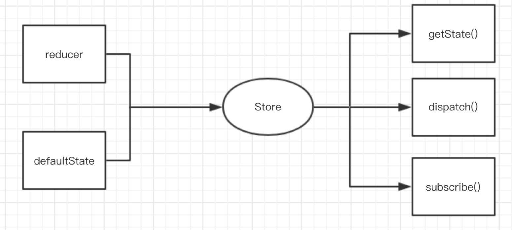
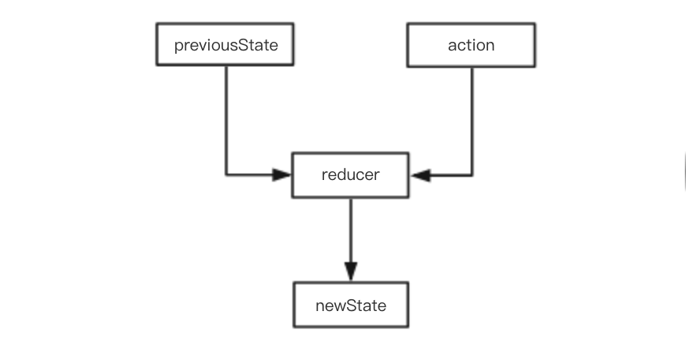
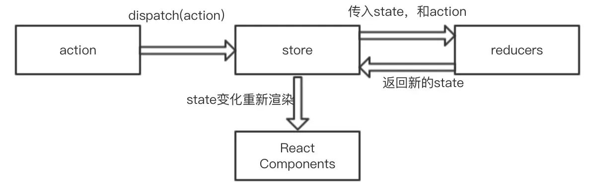
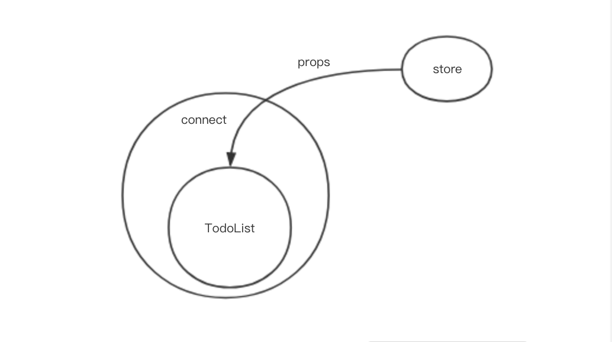

# Redux 和 React-Redux

## Redux
Redux是一种架构模式，是由flux发展而来的。

### Redux三大原则
1. 唯一数据源
2. 状态只读
3. 数据改变只能通过纯函数（reducer）完成

### Redux核心api
Redux主要由三部分组成：store，reducer，action。

#### store
Redux的核心是store，它由Redux提供的 createStore(reducer， defaultState) 这个方法生成，生成三个方法，getState(),dispatch(),subscrible()。



* getState()：存储的数据，状态树；
* dispatch(action)：分发action，并返回一个action，这是唯一能改变store中数据的方式；
* subscrible(listener)：注册一个监听者，store发生变化的时候被调用。

#### reducer
reducer是一个纯函数，它根据previousState和action计算出新的state。



#### action
action本质上是一个JavaScript对象，其中必须包含一个type字段来表示将要执行的动作，其他的字段都可以根据需求来自定义。
```
const ADD_TODO = 'ADD_TODO'
```
```
{
  type: ADD_TODO,
  text: 'Build my first Redux app'
}
```

### 整合


## React-Redux
Redux 本身和React没有关系，只是数据处理中心，是React-Redux让他们联系在一起。

React-Redux提供两个方法：connect和Provider。

## connect
connect连接React组件和Redux store。connect实际上是一个高阶函数，返回一个新的已与 Redux store 连接的组件类。

```
const VisibleTodoList = connect(
  mapStateToProps,
  mapDispatchToProps
)(TodoList)
```
TodoList是 UI 组件，VisibleTodoList就是由 react-redux 通过connect方法自动生成的容器组件。

1. mapStateToProps：从Redux状态树中提取需要的部分作为props传递给当前的组件。
2. mapDispatchToProps：将需要绑定的响应事件（action）作为props传递到组件上。



## Provider
Provider实现store的全局访问，将store传给每个组件。

原理：使用React的context，context可以实现跨组件之间的传递。

## 总结

## 来源文章
* [对React、Redux、React-Redux详细剖析](https://ddduanlian.github.io/2018/06/25/react_redux_react-redux/) 

> redux