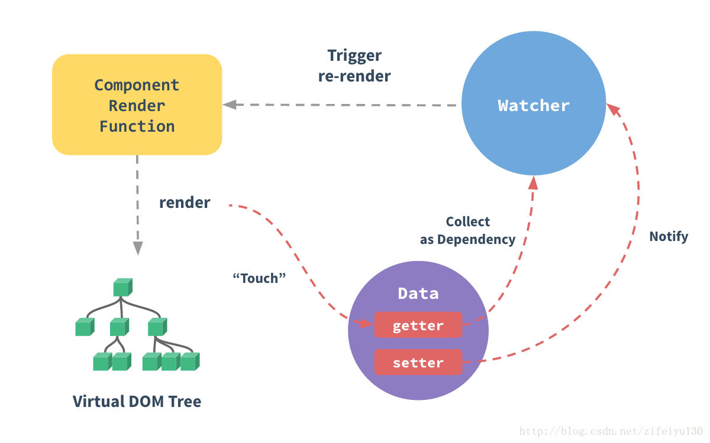

# Vue中数组和对象更改后视图不刷新的问题
## Vue数据响应原理
当你把一个普通的 JavaScript 对象传给 Vue 实例的 data 选项，Vue 将遍历此对象所有的属性，并使用 Object.defineProperty 把这些属性全部转为 getter/setter。

Object.defineProperty 是 ES5 中一个无法 shim 的特性，这也就是为什么 Vue 不支持 IE8 以及更低版本浏览器的原因。 用户看不到 getter/setter，但是在内部它们让 Vue 追踪依赖，在属性被访问和修改时通知变化。这里需要注意的问题是浏览器控制台在打印数据对象时 getter/setter 的格式化并不同，所以你可能需要安装 vue-devtools 来获取更加友好的检查接口。

每个组件实例都有相应的 watcher 实例对象，它会在组件渲染的过程中把属性记录为依赖，之后当依赖项的 setter 被调用时，会通知 watcher 
重新计算，从而致使它关联的组件得以更新。 



## 关于getter和setter的局限性
官方文档解释那么多，说到底就是数据的改变必须能够触发set方法，否则无法响应数据变化。那么，我们就看看set方法在什么时候会被触发，什么时候又不会被触发。
```js
var person = {
    defaultname: 'tom',
    get name() {
        return this.defaultname
    },
    set name(val) {
        this.defaultname = val
        console.log("触发了set")
    }
}
```
这里我们定义一个叫做person的对象，我们通过get/set来控制name，可以看到如果set被触发，就会打印出触发了set。
```js
person.name
=>"tom"
person.name = 123
=>触发了set
person.name
=>123
```
可以看到我们直接修改name是可以触发set的。
```js
person.name = {name: 'tom'}
=>触发了set
person.name
=>{name: "tom"}
person.name.name = 123123
=>没有打印出任何信息，说明修改name的属性值并没有触发set方法。
person.name.sex = 333
=>没有打印出任何信息，说明添加name的属性值并没有触发set方法。
delete person.name.name
=>没有打印出任何信息，说明删除name的属性值并没有触发set方法。
Object.defineProperty(person.name, 'name', {value: 4444})
=>没有打印出任何信息，说明Object.defineProperty也没有触发set方法。
```
当name是一个对象的时候，我们修改、添加、删除name的属性值都没有触发set方法。
```js
person.name = [1,2,3]
=>触发了set
person.name.push(4)
=>没有打印出任何信息，说明push方法并没有触发set方法。
```
说明数组的push方法也无法触发set方法，同理pop、shift、unshift等原生数组方法也是无法触发set。

## 解决方案
受现代 JavaScript 的限制 (以及废弃 Object.observe)，**Vue 不能检测到对象属性的添加或删除**。由于 Vue 会在初始化实例时对属性执行 getter/setter 转化过程，所以属性必须在 data 对象上存在才能让 Vue 转换它，这样才能让它是响应的。例如：
```js
var vm = new Vue({
  data:{
  a:1
  }
})

// `vm.a` 是响应的

vm.b = 2
// `vm.b` 是非响应的
```
### 1
Vue **不允许**在已经创建的实例上**动态添加新的根级响应式属性** (root-level reactive property)。然而**它可以使用 Vue.set(object, key, value) 方法将响应属性添加到嵌套的对象上**：
```js
Vue.set(vm.someObject, 'b', 2)
```
### 2
您还可以使用 vm.$set 实例方法，这也是全局 Vue.set 方法的别名：
```js
this.$set(this.someObject,'b',2)
```
### 3
有时你想向已有对象上添加一些属性，例如使用 Object.assign() 或 _.extend() 方法来添加属性。但是，添加到对象上的新属性不会触发更新。在这种情况下可以创建一个**新的对象**，让它包含原对象的属性和新的属性：
```js
// 代替 `Object.assign(this.someObject, { a: 1, b: 2 })`
this.someObject = Object.assign({}, this.someObject, { a: 1, b: 2 })
```

### 4.变异方法
Vue 包含一组观察数组的变异方法，所以它们也将会触发视图更新。这些方法如下：
* push()
* pop()
* shift()
* unshift()
* splice()
* sort()
* reverse()

```js
var example1 = new Vue({
  el: '#example-1',
  data: {
    items: [
      { message: 'Foo' },
      { message: 'Bar' }
    ]
  }
})
example1.items.push({ message: 'Baz' }) 
```

### 5.替换数组
变异方法 (mutation method)，顾名思义，会改变被这些方法调用的原始数组。相比之下，也有非变异 (non-mutating method) 方法，例如：filter(), concat() 和 slice() 。这些不会改变原始数组，但总是返回一个新数组。当使用非变异方法时，可以用新数组替换旧数组：
```js
example1.items = example1.items.filter(function (item) {
  return item.message.match(/Foo/)
})
```
你可能认为这将导致 Vue 丢弃现有 DOM 并重新渲染整个列表。幸运的是，事实并非如此。Vue 为了使得 DOM 元素得到最大范围的重用而实现了一些智能的、启发式的方法，所以**用一个含有相同元素的数组去替换原来的数组是非常高效的操作**。

### 注意事项
由于 JavaScript 的限制，Vue 不能检测以下变动的数组：

1. 当你利用索引直接设置一个项时，例如：vm.items[indexOfItem] = newValue
2. 当你修改数组的长度时，例如：vm.items.length = newLength

```js
var vm = new Vue({
  data: {
    items: ['a', 'b', 'c']
  }
})
vm.items[1] = 'x' // 不是响应性的
vm.items.length = 2 // 不是响应性的
```
为了解决第一类问题，以下两种方式都可以实现和 vm.items[indexOfItem] = newValue 相同的效果，同时也将触发状态更新：
```js
// Vue.set
Vue.set(vm.items, indexOfItem, newValue)
```
```js
// Array.prototype.splice
vm.items.splice(indexOfItem, 1, newValue)
```
为了解决第二类问题，你可以使用 splice：
```js
vm.items.splice(newLength)
```
## 文章来源
* [深入响应式原理官方文档](https://cn.vuejs.org/v2/guide/reactivity.html)
* [Object.assign方法介绍](https://developer.mozilla.org/zh-CN/docs/Web/JavaScript/Reference/Global_Objects/Object/assign)
* [getter/setter方法介绍](https://developer.mozilla.org/en-US/docs/Web/JavaScript/Reference/Functions/get)
* [对象的响应问题](https://www.cnblogs.com/tugenhua0707/p/7440400.html)

> vueupdate
