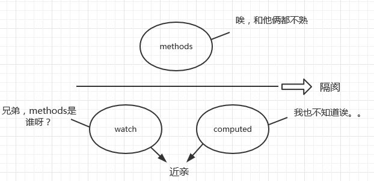
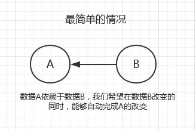
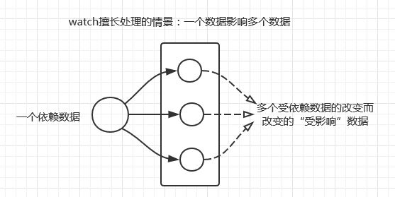
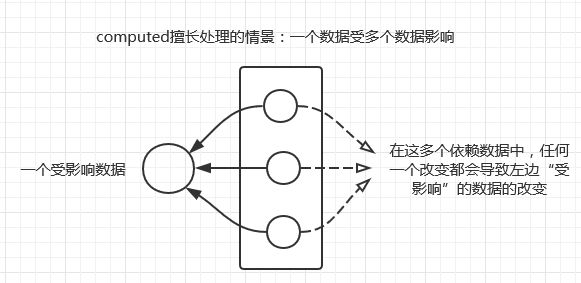
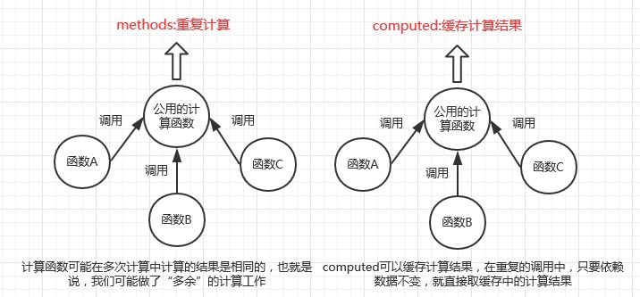
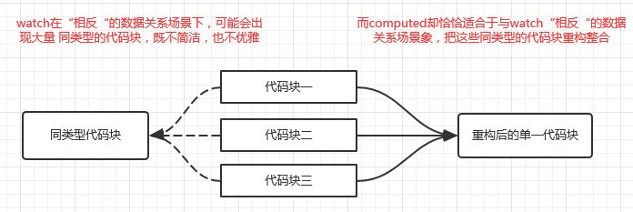

# Vue中的 methods 和 compute 和 watch

## methods,compute和watch的关系



### 从作用机制上
1. watch和computed都是以Vue的依赖追踪机制为基础的，它们都试图处理这样一件事情：当某一个依赖数据发生变化的时候，所有依赖这个数据的“相关”数据“自动”发生变化，也就是自动调用相关的函数去实现数据的变动。
2. 对methods:methods里面是用来定义函数的，需要手动调用执行。

> methods里面定义的函数，是需要主动调用的，而和watch和computed相关的函数，会自动调用,完成我们希望完成的作用

### 从性质上看
1. methods里面定义的是函数，你显然需要像"fuc()"这样去调用它
2. computed是计算属性，在使用上和data对象里的数据属性一样

```
computed:{
   fullName: function () { return this.firstName + lastName }
}
```
你在取用的时候，用this.fullName去取用，就和取data一样（不要当成函数调用）

3. watch:类似于监听机制+事件机制：

```
watch: {
   firstName: function (val) {  this.fullName = val + this.lastName }
}
```
监听firstname的改变，触发事件，firstName对应的函数就相当于监听到事件发生后执行的方法

## watch 和 computed 的对比


共同点：以Vue的依赖追踪机制为基础

不同点：
* **watch擅长处理的场景**：一个数据影响多个数据（监听一个数据，可在回调函数里影响多个数据）
* **computed擅长处理的场景**：一个数据受多个数据影响（一个数据属性可以由函数里多个依赖数据决定）

### watch擅长处理的场景：一个数据影响多个数据


```js
var vm = new Vue({
  el: '#app',
  /*
   data选项中的数据：
   1.haiZeiTuan_Name --> 海贼团名称
   2.船员的名称 = 海贼团名称（草帽海贼团） + 船员名称（例如索隆）
 
   这些数据里存在这种关系：
   （多个）船员名称数据 --> 依赖于 --> （1个)海贼团名称数据
    一个数据变化 --->  多个数据全部变化
  */
  data: {
    haiZeiTuan_Name: '草帽海贼团',
    suoLong: '草帽海贼团索隆',
    naMei: '草帽海贼团娜美',
    xiangJiShi: '草帽海贼团香吉士'
  },
  /*
   在watch中，一旦haiZeiTuan_Name（海贼团名称）发生改变
   data选项中的船员名称全部会自动改变 （suoLong，naMei，xiangJiShi）
   并把它们打印出来
  */
  watch: {
    haiZeiTuan_Name: function (newName) {
      this.suoLong = newName + '索隆' 
      this.naMei = newName + '娜美' 
      this.xiangJiShi = newName + '香吉士'
      console.log(this.suoLong)
      console.log(this.naMei)
      console.log(this.xiangJiShi)
    }
  }
})
 
// 更改watch选项中监控的主数据
vm.haiZeiTuan_Name = '橡胶海贼团'
```
```
// 橡胶海贼团索隆
// 橡胶海贼团娜美
// 橡胶海贼团香吉士
```

### computed擅长处理的场景：一个数据受多个数据影响


```js
var vm = new Vue({
  el: '#app',
  /*
   data选项中的数据：firstName，secName,thirdName
   computed监控的数据：lufei_Name
   两者关系： lufei_Name = firstName + secName + thirdName
   所以等式右边三个数据任一改变，都会直接修改 lufei_Name
  */
  data: {
    // 路飞的全名：蒙奇·D·路飞
    firstName: '蒙奇',
    secName: 'D',
    thirdName: '路飞'
  },
  computed: {
    luFei_Name: function () {
      return this.firstName + this.secName + this.thirdName
    }
  }
})
 
// 将“路飞”改为“海军王”
vm.thirdName = '海军王'
// 打印路飞的全名 console.log(vm.luFei_Name)
// 将“D”改为“H”
vm.secName = 'H'
// 打印路飞的全名
console.log(vm.luFei_Name)
```
```
// 蒙奇D海军王
// 蒙奇H海军王
```

## methods只提供可调用的函数
### 利用computed处理methods存在的重复计算情况



```js
new Vue({
  el: '#app',
  // 设置两个button，点击分别调用getMethodsDate,getComputedDate方法
  template: '<div id="app"><button @click="getMethodsDate">methods</button><button @click="getComputedDate">computed</button></div>',
  methods: {
    getMethodsDate: function () {
      alert(new Date())
    },
    // 返回computed选项中设置的计算属性——computedDate
    getComputedDate: function () {
      alert(this.computedDate)
    }
  },
  computed: {
    computedDate: function () {
      return new Date()
    }
  }
```
点击methods按钮，两次点击返回的时间都是不同的

点击compute按钮，两次点击返回的时间都是相同的，且是第一次调用的时间

> 为什么两次点击computed返回的时间是相同的呢？new Date()不是依赖型数据（不是放在data等对象下的实例数据），所以computed只提供了缓存的值，而没有重新计算

**只有符合：1.存在依赖型数据 2.依赖型数据发生改变这两个条件**,computed才会重新计算。

而methods下的数据，是每次都会进行计算的

### 利用computed处理watch在特定情况下代码冗余的现象，简化代码


```js
new Vue({
  el: '#app',
  data: {
    fullName: '彭湖湾',
    firstName: '彭',
    secName: '湖',
    thirdName: '湾'
  },
  // watch中的代码显然是同类型，重复的，它并不简洁，也不优雅   watch: {
    firstName: function (newValue) {
      this.fullName = newValue + this.secName + this.thirdName
      console.log(this.fullName)
    },
    secName: function (newValue) {
      this.fullName = this.firstName + newValue + this.thirdName
      console.log(this.fullName)
    },
    thirdName: function (newValue) {
      this.fullName = this.firstName + this.secName + newValue
      console.log(this.fullName)
    }
  }
})
```
watch中的代码显然是同类型，重复的，它并不简洁，也不优雅，所以我们可以把它变成这样
```js
new Vue({
  el: '#app',
  data: {
    fullName: '彭湖湾',
    firstName: '彭',
    secName: '湖',
    thirdName: '湾'
  },
  // 对watch中的代码进行重构，实现同样效果
  computed: function () {
    this.fullName = this.firstName + this.secName + this.thirdName
    console.log(this.fullName)
  }
})

```

## 文章来源
[谈Vue的依赖追踪系统 ——搞懂methods watch和compute的区别和联系](https://zhuanlan.zhihu.com/p/30584492)