# Vue 组件通信
* [父->子组件间的数据传递](#父->子组件间的数据传递)
* [子->父组件间的数据传递](#子->父组件间的数据传递)
* [兄弟组件间的数据传递](#兄弟组件间的数据传递)
* [组件深层嵌套，祖先组件与子组件间的数据传递](#组件深层嵌套，祖先组件与子组件间的数据传递)
* [全局组件间的数据交流](#全局组件间的数据交流)

## 概念
先上一张图：


## 父->子组件间的数据传递
### 方法一：props
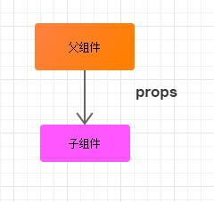

```js
// 父组件
<template>
  <div id="father">
    {{ '我是父组件' }}
    <son :text = "text"></son>
  </div>
</template>
 
<script>
import son from './son.vue'
export default {
  data: function () {
    return {
      text: '从父组件传来的数据'
    }
  },
  components: {
    son: son
  }
}
</script>
 
<style scoped>
</style>
```
```js
// 子组件
<template>
  <div>
    {{ '我是子组件，我接收了' + text }}
  </div>
</template>
 
<script>
export default {
  props: {
    text: { type: String, default: '' }
  }
}
</script>
 
<!-- Add "scoped" attribute to limit CSS to this component only -->
<style scoped>
</style>
```
demo：

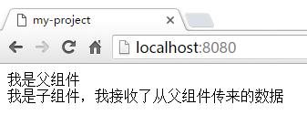

### 方法二：使用$children
使用$children可以在父组件中访问子组件。

## 子->父组件间的数据传递
### 方法一：回调传参
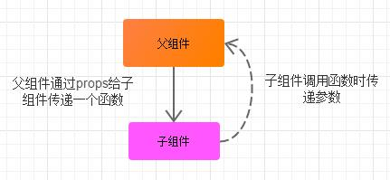

```js
// 父组件
<template>
  <div id="father">
    {{ '我是父组件,名称是' + componentName }}
    <son  :changeComponentName = "changeComponentName"></son>
  </div>
</template>
 
<script>
import son from './son.vue'
export default {
  data: function () {
    return {
      componentName: '组件A'
    }
  },
 
  methods: {
    changeComponentName: function (newComponentName) {
      this.componentName = newComponentName
    }
  },
 
  components: {
    son: son
  }
}
</script>
 
<style scoped>
  #father div{
    padding: 10px;
    margin: 10px;
    border: 1px solid gray;
  }
</style>
```

```js
// 子组件
<template>
  <div>
    <p>我是子组件：一个button</p>
    <button @click="() => changeComponentName(newComponentName)">
      把父组件的名称修改为：彭湖湾的组件
    </button>
  </div>
</template>
 
<script>
export default {
  data: function () {
    return {
      newComponentName: '彭湖湾的组件'
    }
  },
  props: {
    changeComponentName: {
      type: Function,
      default: () => { }
    }
  }
}
</script>
 
<!-- Add "scoped" attribute to limit CSS to this component only -->
<style scoped>
</style>
```
点击前：

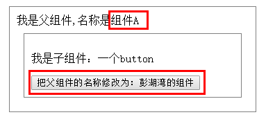

点击后：

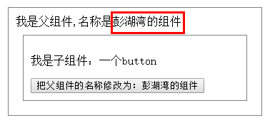

我们从父组件向子组件传递了一个函数（changeComponentName）。并在子组件调用这个函数的时候，以参数的形式传递了一个子组件内部的数据（newComponentName）给这个函数，这样，在父组件中定义的函数（changeComponentName）就可以取得子组件传来的参数了

### 方法二：自定义事件
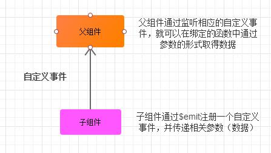

```js
// 父组件
<template>
  <div id="father">
    <div>
       我是父组件,我接受到了：
      {{ text || '暂无数据'  }}
      <son @sendData='getSonText'></son>
    </div>
  </div>
</template>
 
<script>
import son from './son.vue'
export default {
  data: function () {
    return {
      text: ''
    }
  },
  components: {
    son: son
  },
  methods: {
    getSonText (text) {
      this.text = text
    }
  }
}

</script>
 
<style scoped>
#father div {
  padding: 10px;
  margin: 10px;
  border: 1px solid grey;
  overflow: hidden;
}
</style>
```
```
// 子组件
<template>
  <div>
    <p>我是子组件,我所拥有的数据： {{ text }}</p>
    <button @click="sendData">
      发送数据
    </button>
  </div>
</template>
 
<script>
export default {
  data () {
    return {
      text: '来自子组件的数据'
    }
  },
  methods: {
    sendData () {
      this.$emit('sendData', this.text)
    }
  }
}
</script>
 
<!-- Add "scoped" attribute to limit CSS to this component only -->
<style scoped>
   button { float: left }
</style>
```
点击前：

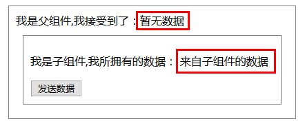

点击后：

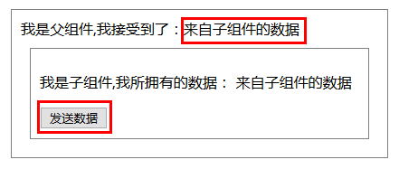

### 方法三：使用ref属性
方法一和方法二的局限性：它们都需要以事件机制为基础（无论是像click那样的原生事件还是自定义事件），而在事件发生的时候才能调用函数将数据传递过来

但如果子组件里没有类似“按钮”的东西，因而无法制造原生事件，同时也没办法找到一个触发自定义事件的时机的时候，怎么从子组件向父组件传递数据呢？？

这个时候， 我们就只能从父组件中“直接取”子组件的数据了，借助ref属性

ref是我们经常用到的Vue属性，利用它可以简单方便地从本组件的template中取得DOM实例，而实际上，如果你在父组件中为子组件设置ref的话， 就可以直接通过```vm.$refs.[子组件的ref].[子组件的属性]```去拿到数据
```js
// 父组件
<template>
  <div id="father">
    <div>
       我是父组件,我接受到了：
      {{ text || '暂无数据'  }}
      <button @click="getSonText()">接受数据</button>
      <son ref='son'></son>
    </div>
  </div>
</template>
 
<script>
import son from './son.vue'
export default {
  data: function () {
    return {
      text: ''
    }
  },
  components: {
    son: son
  },
  methods: {
    getSonText () {
      this.text = this.$refs.son.text
    }
  }
}

</script>
 
<style scoped>
#father div {
  padding: 10px;
  margin: 10px;
  border: 1px solid grey;
  overflow: hidden;
}
</style>
```
```js
// 子组件
<template>
  <div>
    <p>我是子组件,我所拥有的数据： {{ text }}</p>
  </div>
</template>
 
<script>
export default {
  data () {
    return {
      text: '来自子组件的数据'
    }
  }
}
</script>
 
<!-- Add "scoped" attribute to limit CSS to this component only -->
<style scoped>
   button { float: left }
</style>
```
点击前：

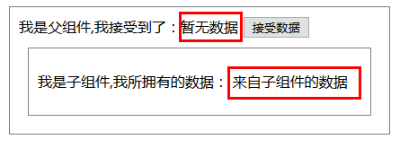

点击后：

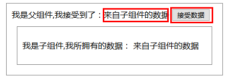

### 方法四：使用$parent
使用$parent可以访问父组件的数据。

## 兄弟组件间的数据传递
### 方法一：路由URL参数
在传统开发时我们常常把需要跨页面传递的数据放到url后面，跳转到另外页面时直接获取url字符串获取想要的参数即可，在vue跨组件时一样可以这么做。在跳转后的组件中用$route.params.id去获取到这个id参数为12，但这种只适合传递比较小的数据，数字之类的。

```
// router index.js 动态路由
{
   path:'/params/:Id',
   component:Params,
   name：Params
}
```
```
// 跳转路由
<router-link :to="/params/12">跳转路由</router-link>
```

### 方法二：Bus通信（中央事件总线）
在组件之外定义一个bus.js作为组件间通信的桥梁，适用于比较小型不需要vuex又需要兄弟组件通信的

1. eventBus.js
```js
import Vue from 'Vue'

export default new Vue()
```
eventBus中我们只创建了一个新的Vue实例，以后它就承担起了组件之间通信的桥梁了，也就是中央事件总线。

2. firstChild.vue
```js
<template>
    <div id="firstChild">
        <h2>firstChild组件</h2>
        <button @click="sendMsg">向组件传值</button>
    </div>
</template>
<script>
import bus from '../assets/eventBus'
export default {
  methods: {
    sendMsg () {
      bus.$emit('userDefinedEvent', 'this message is from firstChild')
    }
  }
}
</script>
```

3. secondChild.vue
```js
<template>
    <div id="secondChild">
        <h2>secondChild组件</h2>
        <p>从firstChild接收的字符串参数：{{msg}}</p>
    </div>
</template>
<script>
import bus from '../assets/eventBus'
export default {
  data () {
    return {
      msg: '默认值'
    }
  },
  mounted () {
    bus.$on('userDefinedEvent', (msg) => {
      this.msg = msg
    })
  }
}
</script>
```

4. App.js
```js
<template>
  <div id="app">
    <first-child></first-child>
    <second-child></second-child>
  </div>
</template>

<script>
import firstChild from './components/firstChild'
import secondChild from './components/secondChild'
export default {
  name: 'App',
  components: {
    firstChild,
    secondChild
  }
}
</script>
```
点击前：

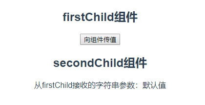

点击后：

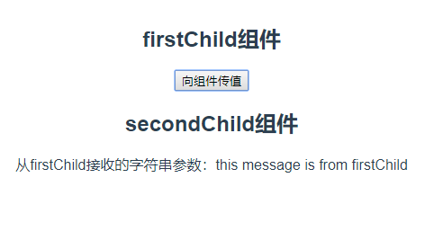

## 组件深层嵌套，祖先组件与子组件间的数据传递
### provide / inject
这对选项需要一起使用，以允许一个祖先组件向其所有子孙后代注入一个依赖，不论组件层次有多深，并在起上下游关系成立的时间里始终生效。这与 React 的上下文特性很相似。

> provide 和 inject 主要为高阶插件/组件库提供用例。并不推荐直接用于应用程序代码中。

详见： [api](https://cn.vuejs.org/v2/api/#provide-inject)


## 全局组件间的数据交流
### Vuex


Vuex拥有一个包含全部顶层状态的单一数据源（state）
1. 所有的组件都可以使用这个单一数据源里面的数据
2. 所有的组件都可以通过派发 动作（actions）修改这个单一数据源里的数据

## 文章来源
* [浅谈Vue不同场景下组件间的数据交流](https://www.cnblogs.com/penghuwan/p/7286912.html)
* [Vue中的父子组件通讯以及使用sync同步父子组件数据](https://www.cnblogs.com/penghuwan/p/7473375.html)
* [vue组件通信全面总结](https://segmentfault.com/a/1190000016627804)
* [聊聊 Vue.js 组件间通信](https://juejin.im/post/59ec95006fb9a0451c398b1a#comment)