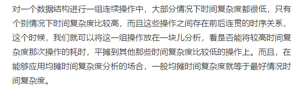

# 数据结构与算法之美
* [概述](#概述)
* [复杂度分析（上）：如何分析、统计算法的执行效率和资源消耗？](#复杂度分析（上）：如何分析、统计算法的执行效率和资源消耗？)
* [复杂度分析（下）：浅析最好、最坏、平均、均摊时间复杂度](#复杂度分析（下）：浅析最好、最坏、平均、均摊时间复杂度)
* [数组：为什么很多编程语言中数组都从0开始编号？](#数组：为什么很多编程语言中数组都从0开始编号？)
* [链表（上）：如何实现LRU缓存淘汰算法?](#链表（上）：如何实现LRU缓存淘汰算法?)
* [](#)
* [](#)
* [](#)
* [](#)
* [](#)


## 概述
从广义上讲，数据结构就是指一组数据的存储结构。算法就是操作数据的一组方法

比如，因为数组具有随机访问的特点，常用的二分查找算法需要用数组来存储数据。但如果我们选择链表这种数据结构，二分查找算法就就无法工作了，因为链表并不支持随机访问。


最常用的20个数据结构与算法：
* 数组、链表。栈、队列、散列表、二叉树、堆、跳表、图、Tried树
* 递归、排序、二分查找、搜索、哈希算法、贪心算法、分治算法、回溯算法、动态规划、字符串匹配算法

## 复杂度分析（上）：如何分析、统计算法的执行效率和资源消耗？
### 为什么需要复杂度分析？
事后统计法：把代码跑一遍，通过统计、监控，就能得到正确的算法执行时间和占用内存大小。

缺点：
1. 测试结果依赖测试环境
2. 测试结果受数据规模的影响很大

### 大O复杂度表示法
求1,2,3...n的累加和
```
int cal(int n){
  int sum = 0;
  int i = 1;
  for(;i<=n;++i){
    sum = sum + i;
  }
  return sum;
}
```
第2、3行代码分别需要1个unit_time的执行时间，第4、5行都运行了n遍，所以需要2n*unit_time的执行时间，总得执行时间是(2n+2)*unit_time

所有代码的执行时间 T(n) 与每行代码的执行次数成正比。

```
int cal(int n)[
  int sum = 0;
  int i = 1;
  int j = 1;
  for(;i<=n;i++){
    j=1;
    for(;j<=n;j++){
      sum = sum + i * j;
    }
  }
}
```
我们依旧假设每个语句的执行时间是 unit_time。那这段代码的总执行时间 T(n) 是多少呢？

第 2、3、4 行代码，每行都需要 1 个 unit_time的执行时间，第 5、6 行代码循环执行了 n 遍，需要 2n* unit_time 的执行时间，第 7、8 行代码循环执行了 n^2遍，所以需要 2n^2 * unit_time 的执行时间。所以，整段代码总的执行时间 T(n) = (2n^2+2n+3)*unit_time。

**所有代码的执行时间 T(n) 与每行代码的执行次数成正比。**

> T(n) = O(f(n))

T(n)代表代码执行时间，n代表数据规模的大小，f(n)代表每行代码执行的次数总和。因为这是一个公式，所以用 f(n) 来表示。公式中的 O，表示代码的执行时间 T(n) 与 f(n) 表达式成正比。

第一个例子中的 T(n) = O(2n+2)，第二个例子中的T(n) = O(2n2+2n+3)。这就是大 O 时间复杂表示法。大 O 时间复杂度实际上并不具体表示代码真正的执行时间，而是表示代码执行时间随数据规模增长的变化趋势，所以，也叫作渐进时间复杂度（asymptotic time complexity），简称时间复杂度。

当 n 很大时，你可以把它想象成 10000、100000。而公式中的低阶、常量、系数三部分并不左右增长趋势，所以都可以都可以忽略。我们只需要记录一个最大量级就可以了，如果用大 O表示法表示刚讲的那两段代码的时间复杂度，就可以记为：T(n)= O(n)； T(n) = O(n2)。

### 时间复杂度分析
1. **只关注循环执行次数最多的一段代码（如栗一）**

2. **加法法则：总复杂度等于量级最大的那段代码的复杂度**

```
int cal(int n){
  int sum_1 = 0;
  int p = 1;
  for(;p<100;++p){
    sum_1 = sum_1 + p;
  }

  int sum_2 = 0;
  int q = 1;
  for(;q<n;++q){
    sum_2 = sum_2 + q;
  }

  int sum_3 = 0;
  int i = 1;
  int j = 1;
  for(;i<=n;i++){
    j=1;
    for(;j<=n;j++){
      sum_3 = sum_3 + i * j;
    }
  }

  return sum_1 + sum_2 + sum_3;
}  
```
第一段的时间复杂度是多少呢？这段代码循环执行了 100 次，所以是一个常量的执行时间，跟 n 的规模无关。可以忽略，只要是一个已知的数，都是常量级别的，与n无关。

那第二段代码和第三段代码的时间复杂度是多少呢？答案是 O(n) 和 O(n2)

综合这三段代码的时间复杂度，我们取其中最大的量级。所以，整段代码的时间复杂度就为 O(n2)。也就是说：总的时间复杂度就等于量级最大的那段代码的时间复杂度。

> 如果 T1(n)=O(f(n))，T2(n)=O(g(n))；那么 T(n)=T1(n)+T2(n)=max(O(f(n)), O(g(n))) =O(max(f(n), g(n))).

3. 乘法法则：嵌套代码的复杂度等于嵌套内外代码复杂度的乘积

> 如果 T1(n)=O(f(n))，T2(n)=O(g(n))；那么 T(n)=T1(n) * T2(n)=O(f(n))*O(g(n))=O(f(n)*g(n)).

```
int cal(int n){
  int ret = 0;
  int i = 1;
  for(;i<n;++i){
    ret = ret + f(i);
  }
}

int f(int n){
  int sum = 0;
  int i = 1;
  for(;i<n;++i){
    sum = sum + i;
  }
  return sum;
}
```
单独看 cal() 函数。假设 f() 只是一个普通的操作，那第 4～6 行的时间复杂度就是，T1(n) = O(n)。但 f() 函数本身不是一个简单的操作，它的时间复杂度是 T2(n) = O(n)，所以，整个 cal() 函数的时间复杂度就是，T(n) = T1(n) * T2(n) = O(n*n)= O(n2)。

### 几种常见时间复杂度实例分析


* 多项式量级
* 非多项式量级：O(2^n)、O(n!)

我们把时间复杂度为非多项式量级的算法问题叫作NP（Non-Deterministic Polynomial，非确定多项式）问题。当数据规模n越来越大时，非多项式时间复杂度的算法其实是非常低效的算法。

1. **O(1)**

O(1) 只是常量级时间复杂度的一种表示方法，并不是指只执行了一行代码。比如这段代码，即便有 3 行，它的时间复杂度也是O(1），而不是 O(3)。

只要代码的执行时间不随n的增大而增长，这样的代码的时间复杂度都记做O(1)。一般情况下，只要算法中不存在循环语句、递归语句，即使有成千上外行代码，其复杂度也是O(1)。

2. **O(logn)、O(nlogn)**
```
i = 1;
while(i<=n){
  i = i * 2;
}
```


2^x = n

x=log2(n)

时间复杂度：O(log2(n))

```
i = 1;
while(i<=n){
  i = i * 3;
}
```
时间复杂度：O(log3(n))

实际上，不管是以 2 为底、以 3 为底，还是以 10 为底，我们可以把所有对数阶的时间复杂度都记为 O(logn)。为什么呢？

对数之间是可以互相转换的，log3(n)就等于log3(2) * log2(n)，所以 O(log3n) = O(C * log2n)，其中C=log32 是一个常量。在采用大 O 标记复杂度的时候，可以忽略系数，即 O(Cf(n)) = O(f(n))。所以，O(log2n) 就等于 O(log3n)。因此，在对数阶时间复杂度的表示方法里，我们忽略对数的“底”，统一表示为O(logn)。

对于O(nlogn)，如果一段代码的时间复杂度是O(logn)，我们循环执行n遍，时间复杂度就是O(nlogn)。归并排序、快速排序时间复杂度都是O(nlogn)。

3. **O(m+n)、O(m*n)**

```
int cal(int m,int n){
  int sum_1 = 0;
  int i = 1;
  for(;i<m;++i){
    sum_1 = sum_1 + i;
  }

  int sum_2 = 0;
  int j = 1;
  for(;j<n;++j){
    sum_2 = sum_2 + j;
  }

  return sum_1+sum_2;
}
```
从代码中看出，m和b 是表示两个数据规模，无法评估m和n谁的量级大，所以在表示复杂度的时候，就不能简单地利用加法法则，省略其中的一个，因此O(m+n)

针对这种情况更改一下加法法则如下，但是乘法法则不变
> T1(m) + T2(n) = O(f(m) + g(n))

### 空间复杂度分析
空间复杂度全称就是渐进空间复杂度（asymptotic space complexity），表示算法的存储空间与数据规模之间的增长关系。

```
void print(int n){
  int i=0;
  int[] a = new int[n];
  for(i;i<n;++i){
    a[i] = i * i;
  }

  for(i=n-1;i>=0;--i){
    print out a[i]
  }
}
```
第 2 行代码中，我们申请了一个空间存储变量 i，但是它是常量阶的，跟数据规模 n 没有关系，所以我们可以忽略。第 3 行申请了一个大小为 n 的 int 类型数组，除此之外，剩下的代码都没有占用更多的空间，所以整段代码的空间复杂度就是O(n)

常见空间复杂度：O(1)、O(n)、O(n^2)

### 内容小结
复杂度也叫渐进复杂度，包括时间复杂度和空间复杂度，用来分析算法执行效率与数据规模之间的增长关系，可以粗略地表示，越高阶复杂度的算法，执行效率越低。常见的复杂度并不多，从低阶到高阶有：O(1)、O(logn)、O(n)、O(nlogn)、O(n2 )


## 复杂度分析（下）：浅析最好、最坏、平均、均摊时间复杂度
### 最好、最坏时间复杂度
```
// n 表示数组array的长度
int find(int[] array,int n,int x){
  int i = 0;
  int pos = -1;
  for(;i<n;++i){
    if(array[i] == x) pos = i;
  }
  return pos;
}
```
这段代码的功能：在一个无序的数组array中，查找变量x出现的位置。如果没有找到，就返回-1。这段代码的复杂度是O(n)，n代表数组长度。

当我们在数组中查找一个数据，不一定要遍历整个数组，可以中途找到就停止。优化一下代码：
```
// n 表示数组array的长度
int find(int[] array,int n,int x){
  int i = 0;
  int pos = -1;
  for(;i<n;++i){
    if(array[i] == x){
      pos = i;
      break;
    }
  }
  return pos;
}
```
如果数组中第一个元素正好是要查找的变量x，那就不需要继续遍历剩下的n-1个数据了，时间复杂度就是O(1)。如果数组中不存在变量x，那我们需要把整个数组都遍历一遍，时间复杂度变成了O(n)。

* 最好时间复杂度：在最理想的情况下，执行这段代码的时间复杂度
* 最坏时间复杂度：在最糟糕的情况下，执行这段代码的时间复杂度

### 平均时间复杂度
要查找的变量 x 在数组中的位置，有 n+1 种情况：在数组的 0～n-1 位置中和不在数组中。我们把每种情况下，查找需要遍历的元素个数累加起来，然后再除以 n+1，就可以得到需要遍历的元素个数的平均值，即：


在时间复杂度的大O表示法中，可以省略掉系数、低阶、常量。所以简化之后，平均时间复杂度为O(n)

这个结论虽然正确，但是计算过程稍微有点问题。刚讲的这n+1种情况，出现的该概率并不是一样的。

比如，要查找的变量x，要么在数组里，要么就不在数组里。这两种情况对应的概率统计起来很麻烦，方便理解，假设在数组中与不在数组中的概率都为1/2。另外，要查找的数据出现在0~n-1这n个位置的概率也是一样的，为1/n。所以，根据概率乘法法则，要找的数据出现在0~n-1中任意位置的概率是1/(2n)


这个值就是概率论中的加权平均值，也叫做期望值，所以平均时间复杂度的全称应该叫做**加权平均时间复杂度**或者**期望时间复杂度**。

引入概率之后，前面那段代码的加权平均值为 (3n+1)/4，用大 O 表示法来表示，去掉系数和常量，这段代码的加权平均时间复杂度仍然是 O(n)。

### 均摊时间复杂度
实际上，在大多数情况下，我们并不需要区分最好、最坏、平均情况时间复杂度三种情况。只有同一块代码在不同的情况下，时间复杂度有量级的差距，我们才会使用这三种复杂度表示法来区分。而均摊时间复杂度应用的场景比它更特殊、更加有限。

```
// n 表示数组array的长度
// 代码中的array.length就等于n

int[] array = new int[n];
int count = 0;

void insert(int val){
  if(count == array.length){
    int sum = 0;
    for(int i = 0;i<array.length;i++){
      sum = sum + array[i];
    }
    array[0] = sum;
    count = 1;
  }
   
  array[count] = val;
  ++count;
}

```
实现了一个往数组中插入数据的功能，当数组满了之后，也就是代码中count==array.length时，用for循环遍历数组求和，并清空数组，将求和之后的sum值放到数组的第一个位置，然后再将新的数据插入。但如果数组一开始就有空闲空间，则直接将数据插入数组。

最理想情况，数组中有空闲空间，只需要将数据插入到数组下标为count的位置就可以了，所以最好时间复杂度为O(1)。最坏情况下，数组没有空闲时间了，需要先做一次数组遍历求和，然后再将数据插入，所以最坏为O(n)。

平均时间复杂度为O(1)：

假设数组长度是n，根据数据插入的位置的不同，我们可以分为n种情况，每种情况的时间复杂度是O(1)。除此之外，还有一种额外的情况，就是在数组没有空闲空间时插入一个数据，此时时间复杂度是O(n)。而且，这n+1种情况发生的概率一样，都是1/(n+1)。所以用加权平均的计算方法，我们求得的平均时间复杂度就是：


对比insert()和find()区别：
* find()函数在极端情况下，复杂度为O(1)。但insert()在大部分情况下，时间复杂度都为O(1)。
* 对于 insert() 函数来说，O(1) 时间复杂度的插入和 O(n) 时间复杂度的插入，出现的频率是非常有规律的，而且有一定的前后时序关系，一般都是一个 O(n) 插入之后，紧跟着 n-1 个 O(1) 的插入操作，循环往复。

因此我们无需像之前将平均复杂度分析方法那样，找出所有的输入情况以及相应的发生概率，然后再计算加权平均值。

每一次O(n)的插入操作，都会跟着n-1次O(1)的插入操作，所以把耗时多的那次操作均摊到接下来的n-1次耗时少的操作上，均摊下来，这一组连续的操作的均摊时间复杂度就是O(1)



```
// 全局变量，大小为 10 的数组 array，长度 len，下标i
int array[] = new int[10];
int len = 10;
int i = 0;

// 往数组中添加一个元素
void add(int element){
  if(i >= len){ // 数组空间不够了
  // 重新申请一个 2 倍大小的数组空间
  int new_array[] = new int[len*2];
  // 把原来 array 数组中的数据依次 copy 到 new_array
  for(int j=0;j<len;++j){
    new_array[j] = array[j];
  }

  // new_array复制给array，array现在大小就是2倍len
  array = new_array;
  len = 2 * len;
}

  // 将element放到下标为i的位置，下标i加一
  array[i] = element;
  ++i
}
    
```
* 最优时间复杂度：O(1)
* 最差时间复杂度：O(n)
* 均摊时间复杂度：O(1)

第一种计算方式: (1+1+...+1+n)/(n+1) = 2n/(n+1) 【注: 式子中1+1+...+1中有n个1】,所以平均复杂度为O(1);

第二种计算方式(加权平均法，又称期望): 1 * (1/n+1)+1 * (1/n+1)+...+1 * (1/n+1)+n * (1/(n+1))=1，所以加权平均时间复杂度为O(1);

第三种计算方式(均摊时间复杂度): 前n个操作复杂度都是O(1)，第n+1次操作的复杂度是O(n)，所以把最后一次的复杂度分摊到前n次上，那么均摊下来每次操作的复杂度为O(1)

## 数组：为什么很多编程语言中数组都从0开始编号？
数组(Array)是一种线性表数据结构，它用一组连续的内存空间，来存储一组具有相同类型的数据。

### 线性表与非线性表
**线性表**就是数据排成像一条线一样的结构。每个线性表上的数据最多只有前和后两个方向。除了数组、链表、队列、栈也是线性结构。


**非线性表**通常有二叉树、堆、图。在非线性表中，数据不是简单的前后关系。


### 连续的内存空间和相同类型的数据：随机访问和低效增删
#### 随机访问
> eg:长度为10的int类型的数组int[] a = new int[10]。图中，计算机给数组a[10]，分配了一块连续内存空间1000~1039，其中，内存块首地址为base_address = 1000。


计算机会给每个内存单元分配一个地址，计算机通过地址来访问内存中的数据。当计算机需要随机访问数组中的某个元素时，它首先会通过下面的寻址公式，计算出该元素存储的内存地址：

> a[i]_address = base_address + i * data_type_size

其中 data_type_size 表示数组中每个元素的大小。我们举的这个例子里，数组中存储的是 int 类型数据，所以data_type_size 就为 4 个字节。

> 面试题：数组和链表的区别？

链表适合插入、删除、时间复杂度O(1)，数组支持随机访问，根据下标随机访问的时间复杂度为O(1)

【“数组适合查找，查找时间复杂度O(1)”不正确，因为即使排序好的数组，用二分查找，时间复杂度也是O(logn)】

#### 低效增删
> 假设数组的长度为n，如果我们需要将一个数据插入到数组中的第k个位置。为了把第k个位置腾出来，给新来的数据，我们需要将第k~n这部分的元素都顺序往后挪一位。求插入时间复杂度？

* 在数组末尾插入元素，无需移动数据，此时最优时间复杂度为O(1)
* 在数组的开头插入元素，所有数据都需要依次往后挪一位，所以最坏时间复杂度为O(n)
* 因为在每个元素插入元素的概率是一样的，所以平均时间复杂度(1+2+...+n)/n=O(n)

为了避免大规模的数据搬移，还有一个简单的办法，直接将第k位的数据搬移到数组元素的最后，把新的元素直接放入第k个位置


利用这种处理技巧，在特定场景下，第k个位置插入一个元素的时间复杂度降为O(1)，这个处理思想在快排也用到

> 删除第k个位置的数据，为了内存的连续性，也需要搬移数据，不然中间会出现空洞，内存就不连续了

* 删除末尾：最好时间复杂度O(1)
* 删除开头：最差时间复杂度O(n)
* 平均时间复杂度O(n)

实际特殊场景下，并不一定非得追求数组中数据的连续性。如果我们将多次删除操作集中在一起执行，删除效率会变高吗？

> 数组a[10]中存储了8个元素：a，b，c，d，e，f，g，h。现在，我们要依次删除a，b，c三个元素


为了避免d，e，f，g，h这几个数据会被搬移三次，我们可以先记录下已经删除的数据。每次的删除操作并不是真正地搬移数据，只是记录数据已经删除。当数组没有更多空间存储时，我们再触发执行一次真正的删除操作，大大减少了删除操作导致的数据搬移。--此为JVM标记清除垃圾回收算法的核心思想

### 警惕数组的访问越界问题
```
int main(int argc,char* argv[]){
  int i = 0;
  int arr[3] = {0};
  for(;i<=3;i++){
    arr[i] = 0;
    printf("hello world\n");
  }
  return 0;
}
```
结果可能是无限打印“hello world”

当i=3时，数组a[3]访问越界。在C语言中，只要不是访问受限的内存，所有内存空间都可以自由访问。根据寻址公式，a[3]也会被定位到某块不属于数组的内存地址上，这个地址正好是存储变量i的内存地址，那么a[3]=0就相当于i=0，导致无限循环。

java本身会做越界检查，抛出java.lang.ArrayIndexOutOfBoundsException

### 容器能否完全代替数组？
JAVA中的ArrayList、C++STL中的vector

像ArrayList最大的优势就是支持动态扩容，将很多数组操作的细节封装起来。扩容操作设计内存申请和数据搬移，是比较耗时的，如果能实现确定需要存储的数据大小，最好创建时候事先指定，可以省掉很多操作。

对于业务开发，直接使用容器就足够了，省时省力。毕竟损耗一丢丢性能，完全不会影响到系统整体的性能。但如果你是做一些非常底层的开发，比如开发网络框架，性能的优化需要做到极致，这个时候数组就会优于容器，成为首选。

> 二维数组内存寻址：对于 m * n 的数组，a [ i ][ j ] (i < m,j < n)的地址为：
> 
> address = base_address + ( i * n + j) * type_size

[深究 JavaScript 数组 —— 演进&性能](https://link.juejin.im/?target=http%3A%2F%2Flink.zhihu.com%2F%3Ftarget%3Dhttp%253A%2F%2Fvoidcanvas.com%2Fjavascript-array-evolution-performance%2F)

## 链表（上）：如何实现LRU缓存淘汰算法?
缓存：一种提高数据读取性能的技术，常见的CPU缓存、数据库缓存、浏览器缓存等等。

缓存大小有限，当缓存被用满时，哪些数据应该被清出去？哪些应该被保留？这就需要缓存淘汰策略来决定。常见策略有三种：先进先出策略FIFO（First In，First Out）、最少使用策略LFU（Least Frequently Used）、最近最少使用策略LRU（Least Recently Used）

链表：不需要一块连续的内存空间，它通过“指针”将一组零散的内存块串联起来使用。


### 单链表
链表通过指针将一组零散的内存块串联在一起。其中，内存块称为链表的“结点”。为了将所有的阶段串起来，每个链表的结点除了存储数据之外，还需要记录链上的下一个结点的地址，称为后继指针next


* 头结点：第一个结点，记录链表的基地址
* 尾结点：指针不是指向下一个结点，而是指向一个空地址NULL，表示这是链表上最后一个结点。

链表的插入和删除操作只需要考虑相邻结点的指针改变，相应的时间复杂度是O(1)


但是，当链表想要随机访问第k个元素时，因为链表中的数据并非连续存储的，所以无法像数组那样，根据首地址和下标，通过寻址公式就能直接计算出对应的内存地址，而是需要根据地址一个结点一个结点地依次遍历，直到找到相应的结点。需要O(n)时间复杂度。

### 循环链表


当要处理的数据具有环形结构特点时，适合采用循环链表，比如约瑟夫问题

### 双向链表
每个结点不止有一个后继指针next指向后面的结点，还有一个前驱指针prev指向前面的结点。


双向链表需要额外的两个空间来存储后继结点和前驱结点的地址。所以，如果存储同样多的数据，双向链表比单链表占用更多的内存空间。虽然两个指针比较浪费存储空间，但可以支持双向遍历。

从结构上看，双向链表可以支持O(1)时间复杂度的情况下找到前驱结点，正是这样的特点，也使双向链表在某些情况下的插入、删除等操作都要比单链表简单、高效。

> 先来对比删除操作

* 删除结点中“值等于某个给定值”的结点
* 删除给定指针指向的结点

第一种情况，无论单链表还是双向链表，都需要从头结点依次遍历比对给定的值，再通过指针操作删除。尽管单纯的删除操作时间复杂度为O(1)，但遍历查找时间是主要的耗时点，对应时间复杂度为O(n)。

第二种情况，已经找到了要删除的结点，但是删除某个结点q需要知道其前驱结点，而单链表不支持，还是需要从头开始遍历知道p->next=q。但是对于双向链表只需要O(1)时间复杂度内就搞定了

同理，如果在某个指定结点前插入一个结点，双向链表比单链表有很大优势。

对于一个有序链表，双向链表的按值查询效率也比单链表要高

### 空间换时间的设计思想
当内存空间充足的时候，如果更追求代码的执行速度，就选择空间复杂度相对较高、但时间复杂度相对很低的算法或者数据结构。如果内存比较紧缺，比如代码跑在手机或者单片机上，这个时候，就要反过来用时间换空间的设计思路。

缓存就是利用了空间换时间的设计思想。如果我们把数据存储在硬盘上，会比较节省内存，但每次查找数据都要询问一次硬盘，会比较慢。但如果我们通过缓存技术，实现将数据加载在内存中，虽然会比较耗费内存空间，但是每次数据查询的速度就大大提高了。

### 双向循环链表


### 数组vs链表


**数组**
* 优点：连续内存空间，可以借助CPU的缓存机制，预读数组中的数据，访问效率更高。对比链表，它不是连续存储，所以对CPU缓存不友好，没有办法有效预读。
* 缺点：大小固定，声明数组过大，可能没有足够连续空间可分配，导致“内存不足”。如果声明的数组过小，则可能出现不够用的情况，这时只能申请一个更大的内存空间，把原数组拷贝进去，非常费时。对比链表，天然支持动态扩容。

