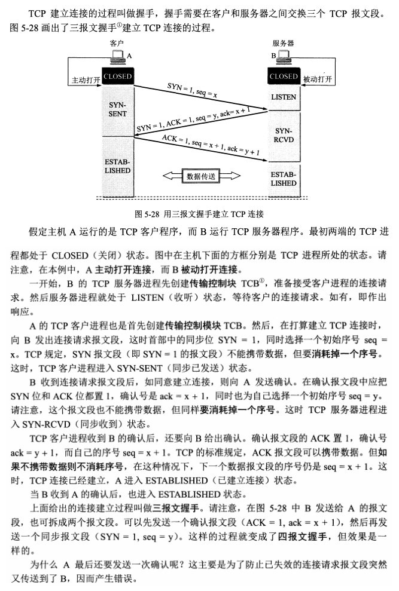

# 计算机网络
## OSI，TCP/IP，五层协议的体系结构，以及各层协议


* OSI分层 （7层）：物理层、数据链路层、网络层、传输层、会话层、表示层、应用层。
* TCP/IP分层（4层）：网络接口层、 网际层、运输层、 应用层。
* 五层协议 （5层）：物理层、数据链路层、网络层、运输层、 应用层。

每一层的协议如下：
* 物理层：RJ45、CLOCK、IEEE802.3 （中继器，集线器）
* 数据链路：PPP、FR、HDLC、VLAN、MAC （网桥，交换机）
* 网络层：IP、ICMP、ARP、RARP、OSPF、IPX、RIP、IGRP、 （路由器）
* 传输层：TCP、UDP、SPX
* 会话层：NFS、SQL、NETBIOS、RPC
* 表示层：JPEG、MPEG、ASII
* 应用层：FTP、DNS、Telnet、SMTP、HTTP、WWW、NFS

每一层的作用如下：
* 物理层：通过媒介传输比特,确定机械及电气规范（比特Bit）
* 数据链路层：将比特组装成帧和点到点的传递（帧Frame）
* 网络层：负责数据包从源到宿的传递和网际互连（包PackeT）
* 传输层：提供端到端的可靠报文传递和错误恢复（段Segment）
* 会话层：建立、管理和终止会话（会话协议数据单元SPDU）
* 表示层：对数据进行翻译、加密和压缩（表示协议数据单元PPDU）
* 应用层：允许访问OSI环境的手段（应用协议数据单元APDU）

## IP地址的分类


1. 网络号剩余字段全为0的IP地址是保留地址，表示本网络，如00000000+24位主机号
2. 主机号全为0表示本网络本身，例如202.98.174.0；主机号全为1表示本网络的广播地址，例如202.98.174.255。
3. 127.X.X.X网络保留做为环路自检地址，该地址表示任意主机本身，目的地址为环路自检地址的IP数据报永远不会出现在任何网络上。
4. 32位全为1，即255.255.255.255表示整个TCP/IP网络的广播地址;32位全为0，即0.0.0.0表示本网络上的本主机。
5. 各类地址中，私有IP地址网段：此时，IP地址与子网掩码相与得到网络号
```
A类：1个A类网段，即10.0.0.0~10.255.255.255
B类：16个B类网段，即172.16.0.0~172.31.255.255
C类：256个C类网段，即192.168.0.0~192.168.255.255
```
## ARP是地址解析协议，工作原理
1. 首先，每个主机都会在自己的ARP缓冲区中建立一个ARP列表，以表示IP地址和MAC地址之间的对应关系。
2. 当源主机要发送数据时，首先检查ARP列表中是否有对应IP地址的目的主机的MAC地址，如果有，则直接发送数据，如果没有，就向**本网段**的**所有主机**发送**ARP数据包**，该数据包包括的内容有：源主机 IP地址，源主机MAC地址，目的主机的IP 地址。
3. 当本网络的所有主机收到该ARP数据包时，首先检查数据包中的IP地址是否是自己的IP地址，如果不是，则忽略该数据包，如果是，则**首先从数据包中取出源主机的IP和MAC地址写入到ARP列表中**，如果已经存在，则覆盖，然后**将自己的MAC地址写入ARP响应包**中，告诉源主机自己是它想要找的MAC地址。
4. 源主机收到ARP响应包后。将目的主机的IP和MAC地址写入ARP列表，并利用此信息发送数据。如果源主机一直没有收到ARP响应数据包，表示ARP查询失败。

**广播发送ARP请求，单播发送ARP响应**

## 各种协议的介绍
1. ICMP协议： 因特网控制报文协议。它是TCP/IP协议族的一个子协议，用于在IP主机、路由器之间传递控制消息。（差错报告、查询、应答）
2. TFTP协议： 是TCP/IP协议族中的一个用来在客户机与服务器之间进行简单文件传输的协议，提供不复杂、开销不大的文件传输服务。
3. HTTP协议： 超文本传输协议，是一个属于应用层的面向对象的协议，由于其简捷、快速的方式，适用于分布式超媒体信息系统。
4. NAT协议：网络地址转换属接入广域网(WAN)技术，是一种将私有（保留）地址转化为合法IP地址的转换技术，
5. DHCP协议：动态主机配置协议，是一种让系统得以连接到网络上，并获取所需要的配置参数手段，使用UDP协议工作。具体用途：给内部网络或网络服务供应商自动分配IP地址，给用户或者内部网络管理员作为对所有计算机作中央管理的手段。

## 描述RARP协议
RARP是逆地址解析协议，作用是完成硬件地址到IP地址的映射，主要用于无盘工作站，因为给无盘工作站配置的IP地址不能保存。工作流程：在网络中配置一台RARP服务器，里面保存着IP地址和MAC地址的映射关系，当无盘工作站启动后，就封装一个RARP数据包，里面有其MAC地址，然后广播到网络上去，当服务器收到请求包后，就查找对应的MAC地址的IP地址装入响应报文中发回给请求者。因为需要广播请求报文，因此RARP只能用于具有广播能力的网络。

## TCP三次握手和四次挥手的全过程


**三次握手**：
* 第一次握手：客户端发送syn包(syn=x)到服务器，并进入SYN_SEND状态，等待服务器确认；
* 第二次握手：服务器收到syn包，必须确认客户的SYN（ack=x+1），同时自己也发送一个SYN包（syn=y），即SYN+ACK包，此时服务器进入SYN_RECV状态；
* 第三次握手：客户端收到服务器的SYN＋ACK包，向服务器发送确认包ACK(ack=y+1)，此包发送完毕，客户端和服务器进入ESTABLISHED状态，完成三次握手。

握手过程中传送的包里不包含数据，三次握手完毕后，客户端与服务器才正式开始传送数据。理想状态下，TCP连接一旦建立，在通信双方中的任何一方主动关闭连接之前，TCP 连接都将被一直保持下去。


**四次挥手**：
* 第一次挥手：主动关闭方发送一个FIN，用来关闭主动方到被动关闭方的数据传送，也就是主动关闭方告诉被动关闭方：我已经不 会再给你发数据了(当然，在fin包之前发送出去的数据，如果没有收到对应的ack确认报文，主动关闭方依然会重发这些数据)，但是，此时主动关闭方还可 以接受数据。
* 第二次挥手：被动关闭方收到FIN包后，发送一个ACK给对方，确认序号为收到序号+1（与SYN相同，一个FIN占用一个序号）。
* 第三次挥手：被动关闭方发送一个FIN，用来关闭被动关闭方到主动关闭方的数据传送，也就是告诉主动关闭方，我的数据也发送完了，不会再给你发数据了。
* 第四次挥手：主动关闭方收到FIN后，发送一个ACK给被动关闭方，确认序号为收到序号+1，至此，完成四次挥手。、

## 在浏览器中输入www.baidu.com后执行的全部过程
总体大纲梳理下：
1. 从浏览器接收url到开启网络请求线程（这一部分可以展开浏览器的机制以及进程与线程之间的关系）
2. 开启网络线程到发出一个完整的http请求（这一部分涉及到dns查询，tcp/ip请求，五层因特网协议栈等知识）
3. 从服务器接收到请求到对应后台接收到请求（这一部分可能涉及到负载均衡，安全拦截以及后台内部的处理等等）
4. 后台和前台的http交互（这一部分包括http头部、响应码、报文结构、cookie等知识，可以提下静态资源的cookie优化，以及编码解码，如gzip压缩等）
5. 单独拎出来的缓存问题，http的缓存（这部分包括http缓存头部，etag，catch-control等
6. 浏览器接收到http数据包后的解析流程（解析html-词法分析然后解析成dom树、解析css生成css规则树、合并成render树，然后layout、painting渲染、复合图层的合成、GPU绘制、外链资源的处理、loaded和domcontentloaded等）
7. CSS的可视化格式模型（元素的渲染规则，如包含块，控制框，BFC，IFC等概念）
8. JS引擎解析过程（JS的解释阶段，预处理阶段，执行阶段生成执行上下文，VO，作用域链、回收机制等等）
9. 其它（可以拓展不同的知识模块，如跨域，web安全，hybrid模式等等内容）

[从输入URL到页面加载的过程？](http://www.dailichun.com/2018/03/12/whenyouenteraurl.html)

## DNS域名系统，简单描述其工作原理。
[DNS原理及其解析过程【精彩剖析】](http://blog.51cto.com/369369/812889)


1、在浏览器中输入www.qq.com域名，操作系统会先检查自己本地的hosts文件是否有这个网址映射关系，如果有，就先调用这个IP地址映射，完成域名解析。 

2、如果hosts里没有这个域名的映射，则查找本地DNS解析器缓存，是否有这个网址映射关系，如果有，直接返回，完成域名解析。 

3、如果hosts与本地DNS解析器缓存都没有相应的网址映射关系，首先会找TCP/ip参数中设置的首选DNS服务器，在此我们叫它本地DNS服务器，此服务器收到查询时，如果要查询的域名，包含在本地配置区域资源中，则返回解析结果给客户机，完成域名解析，此解析具有权威性。 

4、如果要查询的域名，不由本地DNS服务器区域解析，但该服务器已缓存了此网址映射关系，则调用这个IP地址映射，完成域名解析，此解析不具有权威性。 

5、如果本地DNS服务器本地区域文件与缓存解析都失效，则根据本地DNS服务器的设置（是否设置转发器）进行查询，如果未用转发模式，本地DNS就把请求发至13台根DNS，根DNS服务器收到请求后会判断这个域名(.com)是谁来授权管理，并会返回一个负责该顶级域名服务器的一个IP。本地DNS服务器收到IP信息后，将会联系负责.com域的这台服务器。这台负责.com域的服务器收到请求后，如果自己无法解析，它就会找一个管理.com域的下一级DNS服务器地址(qq.com)给本地DNS服务器。当本地DNS服务器收到这个地址后，就会找qq.com域服务器，重复上面的动作，进行查询，直至找到www.qq.com主机。 

6、如果用的是转发模式，此DNS服务器就会把请求转发至上一级DNS服务器，由上一级服务器进行解析，上一级服务器如果不能解析，或找根DNS或把转请求转至上上级，以此循环。不管是本地DNS服务器用是是转发，还是根提示，最后都是把结果返回给本地DNS服务器，由此DNS服务器再返回给客户机。 


## TCP的三次握手过程？为什么会采用三次握手，若采用二次握手可以吗？

谢希仁版《计算机网络》中的例子:
"已失效的连接请求报文段”的产生在这样一种情况下：
client发出的第一个连接请求报文段并没有丢失，而是在某个网络结点长时间的滞留了，以致延误到连接释放以后的某个时间才到达server。
本来这是一个早已失效的报文段,但server收到此失效的连接请求报文段后，就误认为是client再次发出的一个新的连接请求。
于是就向client发出确认报文段，同意建立连接。

假设不采用“三次握手”，那么只要server发出确认，新的连接就建立了。
由于现在client并没有发出建立连接的请求，因此不会理睬server的确认，也不会向server发送数据,但server却以为新的运输连接已经建立，并一直等待client发来数据。
这样，server的很多资源就白白浪费掉了。
采用“三次握手”的办法可以防止上述现象发生。
例如刚才那种情况，client不会向server的确认发出确认,server由于收不到确认，就知道client并没有要求建立连接。”

## 

(1) **中继器**

中继器工作在物理层，用来连接两个速率相同且数据链路层协议也相同的网段，连接起来的几个网段仍然是一个局域网。

中继器功能是消除数字信号在基带传输中由于经过一长段电缆而造成的失真和衰减，使信号的波形和强度达到所需的要求，其原理是信号再生。

中继器既不能隔离冲突域，也不能隔离广播域。

(2) **集线器**

集线器也工作在物理层，相当于一个多接口的中继器，可以将多个节点连接成一个共享式局域网，但任何时刻只能有一个节点通过公共信道发送数据。

中继器既不能隔离冲突域，也不能隔离广播域。

(3) **网桥**

两个或多个以太网通过网桥连接起来后，就成为一个覆盖范围更大的以太网，而原来的每个以太网就可称为一个网段。

网桥工作在数据链路层的MAC子层，可以互联不同的物理层、不同的MAC子层以及不同速率的以太网，使以太网各网段成为隔离开的碰撞域。

网桥具有过滤帧以及存储转发帧的功能，可以隔离冲突域，但不能隔离广播域。

(4) **交换机**

交换机工作在数据链路层，相当于一个多端口的网桥，是交换式局域网的核心设备。

交换机允许端口之间建立多个并发的连接，允许多对计算机同时通信，实现多个节点之间的并发传输。因此，交换机的每个端口节点所占用的带宽不会因为端口节点数目的增加而减少，且整个交换机的总带宽会随着端口节点的增加而增加。

交换机一般以全双工方式工作，有的局域网交换机采用存储转发方式进行转发，有的交换机采用直通交换方式(即在收到帧的同时立即按帧的目的MAC地址决定帧的转发端口，而不必进行先缓存再进行处理)。

利用交换机可以实现虚拟局域网(VLAN)，VLAN可以隔离冲突域，也可以隔离广播域。

(5) **路由器**

路由器是一种具有多个输入输出端口的专用计算机，其任务是连接不同的网络(连接异构网络)并完成路由转发。

路由器是网络层设备，它实现了网络模型的下三层，即物理层、数据链路层和网络层。路由器隔离了广播域。

路由器主要完成两个功能：分组转发和路由计算。前者处理通过路由器的数据流，关键操作是转发表查询、转发以及相关的队列管理和任务调度等；后者通过和其他路由器进行基于路由协议的交互，完成路由表的计算。

(6) **网关**

在传统TCP/IP术语中，网关(gateway)与路由器(router)没有区别。

在现代网络术语中，网关与路由器的定义不同。网关能在不同协议间移动数据，而路由器是在不同网络间移动数据，相当于传统所说的IP网关。网关是连接两个网络的设备，对于语音网关来说，他可以连接PSTN网络和以太网，这就相当于VOIP，把不同电话中的模拟信号通过网关而转换成数字信号，而且加入协议再去传输。在到了接收端的时候再通过网关还原成模拟的电话信号，最后才能在电话机上听到。

> net


