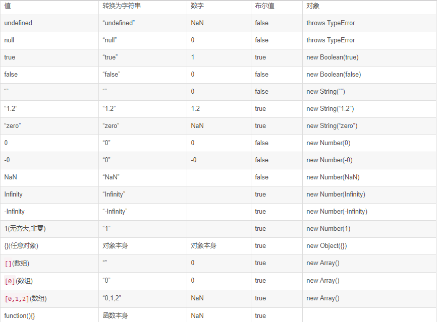

# JavaScript在线编程--运行结果类
* [1.双等号](#1.双等号)
* [2.typeof](#2.typeof)
* [3.命令式和声明式](#3.命令式和声明式)
* [4.作用域](#4.作用域)
* [5.花括号](#5.花括号)

## 1.双等号
```js
const a = [1, 2, 3]
const b = [1, 2, 3]
const c = "1,2,3"

// 双等号比较之前进行强制类型转换
console.log(a == c) // true
// 双等号和全等号对于对象都是进行引用比较
console.log(a == b) // false
console.log(a === b) // false
```
```js
console.log(null == undefined)  // true
console.log(null === undefined) // false

console.log(NaN == NaN) // false，唯一一个不等于自身的类型
console.log(NaN === NaN) // false
```
```js
console.log([] == false) // true，其中一个为布尔，转布尔为数字，[] == 0，0 == 0
console.log({} == false) // false，对象原始值为对象本身，所以和false不等
console.log({} == true) // false，也和true不等

if([]) console.log('1') // '1'
if([1] == [1]) console.log('1') // undefined
```



```js
console.log([] == ![]) // true
console.log([] == []) // false

//!的优先级较==高，先运算==右侧的操作数：[]是对象，会转换成true，然后再转成false（加!的一定是转换成boolean）

// [] 转成 true，然后取反变成 false
[] == false
// 根据第 8 条得出
[] == ToNumber(false)
[] == 0
// 根据第 10 条得出
ToPrimitive([]) == 0
// [].toString() -> ''
'' == 0
// 根据第 6 条得出
0 == 0 // -> true
```

## 2.typeof
```js
console.log(typeof typeof 0) // string=>typeof 0 先转换成'number'
console.log(typeof null) // 'object'=>bug
```

## 3.命令式和声明式
* 命令式编程
```js
const numbers = [1, 2, 3, 4, 5]
const numbersDoubled = []
for (let i = 0; i < numbers.length; i++) {
  numbersDoubled[i] = numbers[i] * 2
}
```

* 声明式编程
```js
const numbers = [1, 2, 3, 4, 5]
const numbersDoubled = numbers.map(n => n * 2)
```

## 4.作用域
```js
var foo = 1
function foobar() {
  console.log(foo) // undefined => 第四行的foo，变量声明提升
  var foo = 2
  console.log(foo) // 2 => 第四行的foo，在第四行赋值
}
foobar()
```

## 5.花括号
```js
function greet() {
  return
  {
    message: "hello"
  }
}

console.log(greet()) // undefined
```
由于 JavaScript 的自动分号插入（ASI），编译器在 return 关键字后面放置一个分号，因此它返回 undefined 而不会抛出错误。